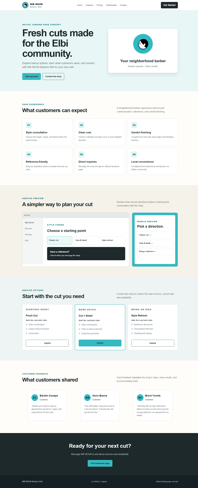
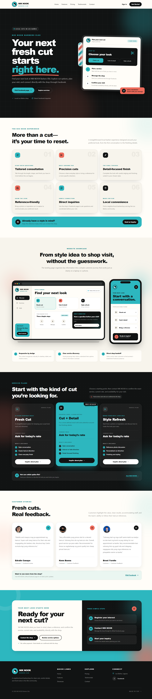

# Before and After Design Comparison

## Context

NIK NOOK Barbers Elbi did not have a standalone landing page available for this project. Its existing public presence was the business's Facebook page. The **before design** is therefore a medium-fidelity concept developed from the available business information and the project's [original low-fidelity wireframe](before-wireframe-original.png); it is not claimed to be a previous website published by NIK NOOK.

The **after design** transforms that starting structure into a polished, responsive Laravel landing page while preserving the shop's name, logo, location context, and direct Facebook connection.

| Before: initial concept | After: final responsive design |
| --- | --- |
|  |  |

## Design Improvements

| Area | Before | After |
| --- | --- | --- |
| Brand identity | Basic teal palette with the existing logo | Expanded teal, coral, cream, and ink visual system |
| Visual hierarchy | Conventional headings, flat sections, and simple cards | Strong display headings, supporting copy, badges, and prominent actions |
| Navigation | Static links with one action and no mobile menu | Sticky desktop navigation and accessible collapsible mobile menu |
| Hero | Simple two-column introduction and logo card | Original inquiry interface mockup and clearer Facebook/service actions |
| Features | Six flat numbered cards | Reusable icon cards with layered details, hover states, and responsive grids |
| Showcase | Basic browser and phone service mockups | Detailed desktop dashboard and mobile service-discovery mockups |
| Pricing | Three lightly styled service cards | Higher-contrast service plans with a clear featured option and richer hierarchy |
| Testimonials | Simple initials and review excerpts | Customer portraits, complete feedback, roles, and source labels |
| Conversion path | Inactive placeholder buttons | Working links that hand visitors to the shop's official Facebook page |
| Footer | Minimal text columns | Branded company summary, quick links, social connection, location, and copyright |
| Responsiveness | One basic stacking breakpoint | Tested desktop, laptop, tablet, and mobile layouts using Tailwind breakpoints |
| Accessibility | Basic semantic landmarks and image text | Skip link, semantic landmarks, alternative text, focus-visible styles, and reduced-motion support |

## Responsive Evidence

- [Desktop view](screenshots/after-desktop.png)
- [Tablet view](screenshots/after-tablet.png)
- [Mobile view](screenshots/after-mobile.png)
- [Expanded mobile navigation](screenshots/navigation-mobile.png)

## Implementation Outcome

The final page provides a coherent customer journey: visitors can understand the shop's value, explore haircut directions, view a responsive product-style showcase, compare service starting points, read customer feedback, and contact NIK NOOK through its established Facebook presence.
